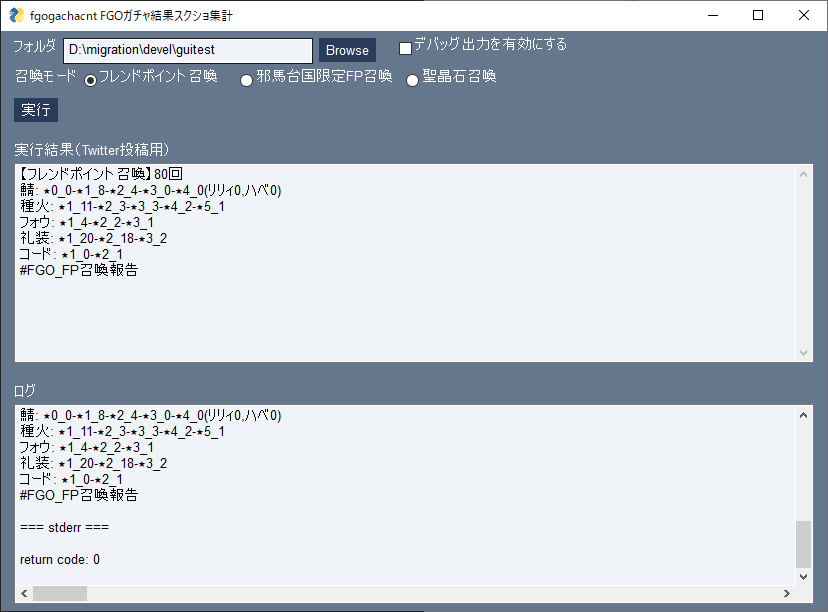
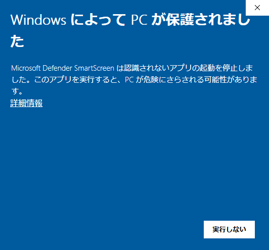

# fgogachacnt

FGO のガチャ結果スクショを集計する

実装されている全てのサーヴァント・概念礼装の認識に対応しています(新規サーヴァント・概念礼装の実装時には `update.py` の実行で対応)

一般的な使用法はしょっぽさんが集計している[フレンドポイント召喚集計](https://sites.google.com/site/gurugurufgo/top/%E3%83%81%E3%83%A9%E3%82%B7%E3%81%AE%E8%A3%8F/%E3%83%95%E3%83%AC%E3%83%B3%E3%83%89%E3%83%9D%E3%82%A4%E3%83%B3%E3%83%88%E5%8F%AC%E5%96%9A%E9%9B%86%E8%A8%88?authuser=0) の詳細報告をするためのツールです



# 必要なソフトウェア

## GUI 版

不要。実行に必要なソフトウェアはすべて同梱されています。

## コマンドライン版

Python 3.7 以降

# ファイル

1. `fgogachacnt.py` :実行ファイル(画像認識)
2. `csv2report.py` :実行ファイル(報告作成)
3. `makecard.py` card.xml を作成
4. `makerarity.py` rarity.xml を作成
5. `data/` 3.4.で使用されるフォルダ
6. `hash_srv.csv` :サーヴァントの認識データ(update.py で更新)
7. `hash_ce.csv` :概念礼装の認識データ(update.py で更新)
8. `hash_ce_center.csv` :概念礼装の認識データ(update.py で更新)
9. `srv_bl.csv`:ガチャから排出されないサーヴァントのリスト
10. `ce_bl.txt` :ガチャから排出されない概念礼装のリスト(絆礼装・記念礼装・経験値礼装以外)
11. `fp_34srv_wl.txt` :フレンドポイントで召喚される ★3★4 サーヴァントのリスト
12. `fp_12ce_bl.txt` :フレンドポイントから排出されなくなった ★1★2 概念礼装のリスト
13. `fp_3ce_wl.txt` :フレンドポイントで召喚される ★3 概念礼装のリスト

以下は 3.実行時に作成される

14. `card.xml`: カード下部の文字を読む SVM のトレーニングファイル
15. `rality.xml`: フォウくんのレアリティを判別する SVM のトレーニングファイル

# インストール

## GUI 版

1. [最新のリリースアーカイブ](https://github.com/fgosc/fgogachacnt/releases) をダウンロード
   - fgogachacnt-gui-windows-\<バージョン番号\>.zip
2. アーカイブを適当なフォルダに解凍

## コマンドライン版

下記コマンドを実行

```
$ pip install -r requirements.txt
$ python makecard.py
$ python makerarity.py
```

※`fgogachacnt.py`, `csv2report.py`, `*.xml`, `*.csv`, `*.txt`を同じフォルダにいれること

# 使い方

## GUI 版

1. `rungui.bat` をダブルクリック
2. スクショが入ったフォルダを指定して「実行」
3. 「実行結果」に結果が出力されたら処理成功
   - 実行完了までの時間は処理するスクショの枚数に比例します。
4. 実行結果の出力内容をチェックし、問題なければコピーして Twitter に投稿

実行結果が表示されない場合、「ログ」に表示されている内容を開発者に報告してください。

### 実行が制限される場合



一般的にインターネットからダウンロードしたプログラムの実行は危険を伴うため、Windows により実行が制限されることがあります。
上記の画面が表示された場合は「詳細情報」をクリックし「実行」ボタンで実行できます。

その他、ご利用のセキュリティソフトにより実行が制限されることも考えられます。
セキュリティソフトにより解除方法は異なりますので、ご自身の責任で対応をお願いします。

## コマンドライン版

```
usage: fgogachacnt.py [-h] [-n {auto,10,11}] [-f FOLDER] [-o] [-d] [-w] [-of OUTFOLDER] [--version] [filenames ...]

FGOの召喚スクショを数えをCSV出力する

positional arguments:
  filenames             入力ファイル

optional arguments:
  -h, --help            show this help message and exit
  -n {auto,10,11}, --num {auto,10,11}
                        召喚数
  -f FOLDER, --folder FOLDER
                        フォルダで指定
  -o, --old             2018年8月以前の召喚画面
  -d, --debug           デバッグ情報の出力
  -w, --watch           フォルダ監視モード
  -of OUTFOLDER, --outfolder OUTFOLDER
                        処理結果JSON出力先
  --version             show program's version number and exit
```

# 実行例

## スクショ処理から召喚報告まで

```
$ python fgogachacnt.py -f image >output.csv
$ python csv2report.py output.csv
【フレンドポイント召喚】10600回
鯖: ★0_0-★1_1091-★2_546-★3_117-★4_9(リリィ3,ハベ6,ザビ男0,ザビ子0)
種火: ★1_913-★2_752-★3_535-★4_314-★5_101
フォウ: ★1_458-★2_223-★3_99
礼装: ★1_3063-★2_1703-★3_516
コード: ★1_92-★2_68
#FGO_FP召喚報告

【まんわかFP召喚】100回
鯖: ★0_0-★1_1091(アニング0)-★2_546-★3_117-★4_9(リリィ3,ハベ6,ザビ男0,ザビ子0)
種火: ★1_913-★2_752-★3_535-★4_314-★5_101
フォウ: ★1_458-★2_223-★3_99
礼装: ★1_3063-★2_1703-★3_516
コード: ★1_92-★2_68
#FGO_FP召喚報告

【邪馬台国限定FP召喚】10600回
鯖: ★0_0-★1_1091(信勝0)-★2_546-★3_117-★4_9(リリィ3,ハベ6,ザビ男0,ザビ子0)
種火: ★1_913-★2_752-★3_535-★4_314-★5_101
フォウ: ★1_458-★2_223-★3_99
礼装: ★1_3063-★2_1703-★3_516-★3EXP_0-★4EXP_0
コード: ★1_92-★2_68
#FGO_FP召喚報告

【聖晶石召喚】0回
★3鯖0-★4鯖0-★5鯖0
★3礼装0-★4礼装0-★5礼装0(うちカレスコ0)
#FGO_聖晶石召喚報告
```

# サーヴァント・概念礼装・コマンドコードデータのアップデート

```
$ python update.py
```

---

- 認識できないカードを初めて認識させた場合、item フォルダ内に servent???.png, ce???.png というファイルができる
- 出力で Duplication が出た場合は、同じ召喚画面を二回スクショしているものである
- ファイル名 servent???.png, ce???.png をアイテム名に変更すると次回実行以降そのアイテム名で表示されるため可読性があがる
- 新規実装カードなどがあるスクショを認識させた場合 `csv2report.py` ではレアリティ認識できないので、分類「その他」として出力されるので計算結果を自分で修正する必要がある
- 1-11 連や聖晶石 or フレンドポイント召喚は自動認識されます

# 制限

- 【重要】全ての機種のスクショの認識に対応しているわけではない
- 概念礼装を自動売却した場合は認識がうまくいかないケースが多いので概念礼装の自動売却設定はオフ推奨です
